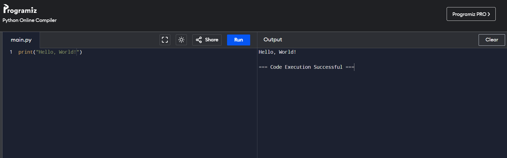

# Python Lesson 1: Welcome to the World of Python!

## Let's Get Started
We're going to use a special website to write our Python code. It's like a playground for coders! [Click here to open it](https://www.programiz.com/python-programming/online-compiler/)

## Understanding Our Code Playground

When you open the website, you'll see a screen that looks like this:



1. **Code Editor**: On the left side, you'll see a big dark area. This is where you'll write your Python code. It's like a special notebook for code!

2. **Filename**: At the top of this area, you'll see "main.py". This tells us we're writing in a Python file.

3. **Run Button**: There's a blue "Run" button at the top. When you finish writing your code, click this button to make your code work!

4. **Output Area**: On the right side, you'll see an area called "Output". This is where you'll see what your code does when you run it.

5. **Example**: In the picture, you can see the code `print("Hello, World!")` on the left, and "Hello, World!" in the Output on the right. This shows that the code worked!

6. **Success Message**: At the bottom of the Output, you'll see "Code Execution Successful". This means your code ran without any problems.

Remember, every time you want to see what your code does, just click the "Run" button. It's like telling your computer, "Okay, let's see what this does!"

## What We'll Learn Today
After this lesson, you'll know:
1. Some basic Python rules (we call these "syntax")
2. How to use `print()` to show words on the screen
3. How to make variables to store information

## Part 1: Python's Special Rules (Syntax)

Python has some special rules that help it understand what we want it to do. Let's learn about a few:

1. **Colons (:)**: We use colons to start a new block of code. You'll see these a lot when we learn about if-statements and loops!

2. **Indentation**: After a colon, we move our next line of code to the right a bit. This is called indentation. It helps Python know which lines of code belong together.

3. **Brackets**: We use different types of brackets in Python:
   - Parentheses ( ) for functions like `print()`
   - Square brackets [ ] for lists (we'll learn about these soon!)
   - Curly braces { } for dictionaries (we'll learn about these later)

Here's an example that uses some of these rules:

```python
if age > 10:
    print("You're older than 10!")
    print("That's cool!")
```

See how we used a colon after `if age > 10`, and then the next two lines are indented?

## Part 2: The Print Function

Now that we know some basic rules, let's start coding! In Python, we use `print()` to show words on the screen. It's like telling the computer to speak! Here's how it looks:

```python
print("Hello, Python!")
```

This will show: Hello, Python!

You can put any words between the quotation marks, and Python will show them.

### Your Turn:
1. Use `print()` to show your name.
2. Use `print()` to show the name of your favorite animal.

## Part 3: Variables

Variables are like magic boxes that hold information. We give them names and put stuff inside them.

To make a variable, we use a name, an equal sign, and what we want to put in it:

```python
age = 10
name = "Alex"
```

Then we can use these variables in our code:

```python
print(name)
print(age)
```

This will show:
Alex
10

### Your Turn:
1. Make a variable called `favorite_color` and put your favorite color in it.
2. Make a variable called `hobby` and put your favorite hobby in it.
3. Use `print()` to show both variables.

## Let's Make: All About Me!

Let's use print, variables, and our new Python knowledge to make a program all about you!

1. Make variables for your name, age, and favorite color.
2. Use `print()` and your variables to show three sentences about yourself.

Here's an example:

```python
name = "Sam"
age = 11
favorite_color = "green"

print("My name is " + name + ".")
print("I am " + str(age) + " years old.")
print("My favorite color is " + favorite_color + ".")
```

Now, make your own "All About Me" program!

## Great Job!
You've finished your first Python lesson! You learned about Python's special rules, how to use `print()` to show words, and how to make variables. Next time, we'll learn more cool things to do with Python!
